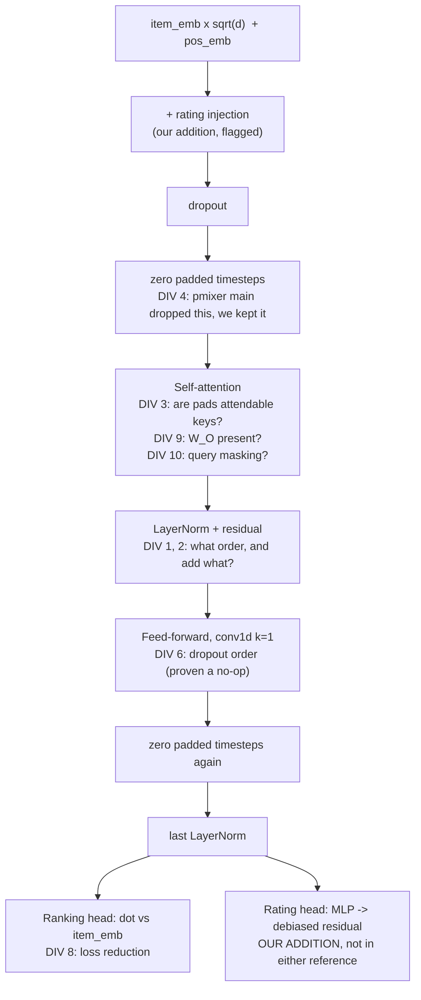

# SASRec port: what the flagged issues actually mean

Written 2026-08-29, for PR [#23](https://github.com/anshumandec94/llm_testing/pull/23) (sub-issue #17 of epic #11).
Audience: someone deciding whether the SASRec arm of the preference-backend benchmark is set up to give SASRec a fair shot.

---

## The question this answers

You said you do not need to reproduce the paper's numbers, but you do expect that on a pure metric benchmark SASRec should come out ahead of the associative methods.
That is the right thing to care about, and it changes which of my flagged issues matter.

The question is not "is this the same model as the paper".
The question is: **could a choice I made cause SASRec to lose to the associative baseline for reasons that have nothing to do with SASRec being a worse preference representation?**

A loss like that would be a measurement artefact, and it is the same class of problem epic #1 spent four sub-issues removing from the LLM comparison.

Everything below is sorted by that criterion, not by how interesting the divergence is.

---

## Short answer

Of the ten divergences in the module docstring, **one** can plausibly bias the result, and it is fixable with a config flag.
Two of the three things I originally flagged for your attention turn out to be non-issues once I checked the evidence.

**But the divergences are not where the real risk lives.**
Three larger issues sit outside that list entirely, and one of them is not a bug at all but a reason your expectation might simply not hold.

| Concern | Real impact on the comparison | Action |
|---|---|---|
| Div 1: post-norm vs pre-norm | **None.** pmixer's own benchmark says our default is the best of the three on MovieLens | Settled, no change |
| Div 3: padded timesteps attendable as keys | **Moderate.** Affects 79% of users | Recommend flipping the flag |
| Div 9: no `W_O` in the TF original | **None.** We have more capacity, not less | No change |
| Divs 2, 4, 5, 6, 7, 8, 10 | **None.** Cosmetic, notational, or already matched | No change |
| `maxlen=200` on ML-32M | **Large.** Discards 39% of all interactions | Needs a decision before real runs |
| `hidden_units=50` for 84,432 items | **Possibly large.** Inherited from a 3,700-item dataset | Needs a decision before real runs |
| SASRec is a ranking model, MAE is a rating metric | **This is the big one.** Not a bug | Read the last section |

---

## Where the divergences sit

---

## Issue by issue

### Divergence 1: post-norm vs pre-norm. Settled, and I was wrong to flag it.

I originally flagged this as needing your call, on the grounds that our default is not the architecture the published numbers came from.
That framing was correct but the implied worry was not, and pmixer ships the evidence that settles it.

`Result_Norm.md` in the pmixer repo benchmarks all three variants on four datasets, with the paper's hyperparameters.
On MovieLens-1M, NDCG@10:

| Norm design | Beauty | **MovieLens-1M** | Video | Steam |
|---|---|---|---|---|
| Original SASRec (kang205) | 0.3104 | 0.5946 | 0.5308 | 0.6167 |
| Pre-LN | **0.3193** | 0.5940 | **0.5376** | **0.6284** |
| Post-LN (**our default**) | 0.3146 | **0.5995** | 0.5297 | 0.6201 |

Two things follow.

First, **the kang205 original is not the best design on any dataset**, and pmixer's own conclusion is "we suggest to use standard LN in SASRec".
So "matching the published architecture" would mean deliberately choosing a weaker model.

Second, **post-norm, which is what we default to, is the best of the three on MovieLens specifically**, which is the dataset family this project runs on.

The spread is small (0.5940 to 0.5995, about 1%) and these are ranking metrics rather than our MAE, so do not over-read it.
But it removes any concern that the default handicaps SASRec.
No change needed, and the `sasrec_norm_first` flag stays available if you ever want to check it on ML-32M.

### Divergence 3: padded timesteps are attendable attention keys. The one that matters.

This is the only divergence that can plausibly bias the comparison.

**What happens.** kang205 masks padded positions out of the attention before the softmax, so they cannot be attended to.
pmixer calls `MultiheadAttention` with no `key_padding_mask`, so each padded position is a real key.
Its projected value is the projection bias, which is constant but not zero, so padded positions absorb attention mass that should have gone to real items.

**Why it is not negligible here.** Sequences are left-padded to `maxlen`, so a user with fewer than `maxlen` interactions carries padding, and under the causal mask every position can see all of it.
On ML-32M:

- **79% of users have fewer than 200 ratings**, so at the default `maxlen=200` roughly four users in five have padded sequences.
- The shorter the history, the higher the padding fraction, so the dilution is **worst for exactly the users who have the least signal to begin with**.

**Why it plausibly biases the comparison specifically.** The associative baseline has no equivalent handicap on light users, so this is not a uniform quality hit that affects both arms.
The project page already records that per-user MAE correlates with rating count, and that the statistical unit for this benchmark is users rather than items.
A defect concentrated in 79% of users, worst where histories are shortest, is exactly the shape that moves a user-clustered mean.

**Recommendation: flip `sasrec_mask_padded_keys` to `True`.**
The flag already exists and is tested. This is a one-line config change.
The argument for keeping `False` is fidelity to pmixer; the argument for `True` is that kang205 masks, the paper's numbers come from the masking version, and the unmasked behaviour looks like an oversight in a port rather than a design choice.
I left the default at `False` because "pmixer is authoritative" is a decision recorded in your plan and I did not want to quietly reverse it, but on the merits I think `True` is correct and I would change it.

I have not measured the size of the effect. That is cheap to do once #18 exists, by training the same config twice, and it is worth doing rather than assuming.

### Divergence 9: no output projection in the TensorFlow original. Not a risk.

kang205's hand-written attention has no `W_O`.
`torch.nn.MultiheadAttention`, which both pmixer and we use, applies one.

This means our model has **more** capacity than kang205, not less, so it cannot explain SASRec underperforming.
It is worth knowing because it interacts with head count: without `W_O` kang205's heads never mix, so at `num_heads > 1` the two references are structurally different models.
We default to `num_heads=1`, the reference setting, so this does not currently bite.

### Divergences 2, 4, 5, 6, 7, 8, 10: no impact on the comparison.

Recorded for completeness and for whoever audits the port later.

- **Div 6 (feed-forward dropout order) is provably a no-op.** I wrote a test to pin it, mutation-tested it, and it could not fail. The reason is that there is nothing to pin: dropout multiplies by a non-negative scalar and ReLU is positively homogeneous, so `relu(dropout(x))` and `dropout(relu(x))` are exactly equal elementwise. This is now documented so nobody hunts for a difference again.
- **Div 4 (zeroing padded timesteps)** is the one place your plan and "pmixer is authoritative" genuinely conflict, because pmixer's current `main` dropped it and the plan's checklist requires it. We kept the zeroing, matching kang205 and older pmixer. This is the more conservative choice and it is tested.
- **Div 10 (query masking)** is made redundant downstream by div 4: a padded position's state is forced to zero at the end of every block either way.
- **Divs 2, 5, 8** are cosmetic or arithmetically equal. **Div 7** is a training-loop concern with a default coefficient of 0.0, so it belongs to #18.

---

## Three things that matter more than any divergence

None of these are port bugs. All three can decide whether SASRec beats the associative baseline.

### 1. `maxlen=200` discards 39% of ML-32M

The default is inherited from the reference's MovieLens-**1M** setting.
ML-32M is a different animal: 200,948 users, 84,432 movies, 32M ratings, mean 159 ratings per user but a median of 73 and a maximum of 33,332.

| `maxlen` | Users truncated | Share of users | Interactions retained |
|---|---|---|---|
| **200** (current default) | 41,918 | 20.9% | **60.8%** |
| 500 | 12,543 | 6.2% | 82.4% |
| 1000 | 3,614 | 1.8% | 93.1% |
| 2000 | 658 | 0.3% | 98.1% |

At `maxlen=200` the model never sees **39% of the interaction data**, and the loss falls entirely on heavy users.
Sequence models are supposed to benefit from long histories, so truncating away most of the data for the users who have the most of it is close to the worst case for the arm you expect to win.

The cost is not free: attention is quadratic in sequence length, so `maxlen=1000` is roughly 25 times the attention compute of 200.
That is a real constraint on the CARC server, and it is a genuine trade-off rather than an obvious win.

**This deserves a deliberate decision before the real runs, not an inherited default.** My instinct is 500 as the compromise, but it depends on your compute budget.

### 2. `hidden_units=50` was chosen for a 3,700-item catalogue

ML-1M has about 3,700 movies. ML-32M has **84,432**.
The reference's 50-dimensional embedding is being asked to represent a catalogue roughly 23 times larger.

For comparison, the recommender in this codebase uses 64 MF factors, and the associative agent's preference space uses 8 SVD dimensions.
So SASRec at 50 is not obviously starved relative to the baseline, and I would not call this a definite problem.
But it is another ML-1M default carried over without examination, and capacity is one of the few things that could make a sequence model underperform a shallow one.

Worth a small sweep in #18, which is cheap because it is smoke-scale.

### 3. SASRec is a ranking model, and you are measuring rating error

**This is the most important thing in this document, and it is not a bug.**

SASRec's published results are ranking metrics: NDCG@10 and HR@10.
Its native objective is BCE over sampled negatives, and its native output is a score with no units.
It was never evaluated on rating prediction, and to my knowledge there is no published result showing SASRec predicts ratings well.

The benchmark measures **MAE in debiased-rating units**.
The associative baseline is `clip(bias + dot, 1, 5)`: a rating-prediction model, trained on ratings, evaluated on rating error.
It is playing its home fixture.

The rating head that makes SASRec commensurable at all is **our invention**, not something from the paper.
It is a small MLP over the sequence state and the target item embedding, trained jointly with the ranking loss.
Its quality determines the SASRec MAE more directly than any backbone choice discussed above.

So: a correctly-ported, well-trained SASRec **can legitimately lose to the associative baseline on MAE**, and that would be a finding rather than a defect.
It would mean "a sequential model's representation, read out through a small regression head, predicts ratings less accurately than a bias-plus-factor model" - which is a defensible and publishable claim.

The trap to avoid is the reverse: assuming a loss must be a bug, and tuning the SASRec arm until it wins.
That is how measurement artefacts get manufactured.

Two guards already in the plan handle this:

- **The bias-only null backend.** It predicts a residual of exactly zero. Any arm that does not beat it is reproducing a two-column lookup table. Your project page notes this has never been computed, costs about 15 seconds, and may not be kind to the *existing* published results either.
- **Per-item predictions written on every run**, so paired user-clustered tests are possible without re-running anything. The 2026-06-26 LLM arms did not do this, which is why no paired test against them is possible today.

If SASRec beats the bias-only null by a healthy margin but loses to associative, that is a real result about representations.
If it does not beat the null, something is wrong with the arm and the port is the first place to look.

---

## What I would actually do

In order:

1. **Flip `sasrec_mask_padded_keys` to `True`.** One line. It affects 79% of users, worst where histories are shortest, and the unmasked version looks like a port oversight rather than a design choice. This is the only divergence I would change.
2. **Decide `maxlen` deliberately** before the real runs, knowing 200 discards 39% of the data and 1000 costs about 25 times the attention compute of 200.
3. **Compute the bias-only null early**, as the plan says. It is 15 seconds and it calibrates every other number, including the ones already published in `reports/llm_vs_associative.md`.
4. **Do not tune SASRec until it wins.** Fix defects that have a mechanism, like items 1 and 2. Report the result you get.
5. When #18 exists, spend the cheap smoke-scale budget on the two ablations that already have flags: `sasrec_mask_padded_keys` and `sasrec_rating_loss_weight=0`.

Items 1 and 2 are config decisions and I have not made either, since both reverse or reinterpret something recorded in your plan.

---

## Provenance

- Divergences were established by reading `pmixer/SASRec.pytorch` at `main` (`python/model.py`, `python/main.py`) against `kang205/SASRec` (`model.py`, `modules.py`), both fetched 2026-08-29. Every claim in the module docstring was independently verified line by line by a review subagent, which also found the two divergences I had missed.
- The norm-design table is quoted from `Result_Norm.md` in the pmixer repository.
- ML-32M distribution figures were computed directly from `data/ml-32m/ratings.csv` on 2026-08-29: 32,000,204 ratings, 200,948 users, 84,432 distinct movies.
- The dropout/ReLU commutation was verified numerically, not reasoned about.
- Both reference repositories are Apache-2.0; the licence files are byte-identical. Recorded in `NOTICES`.
